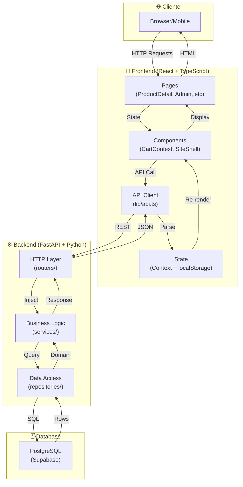
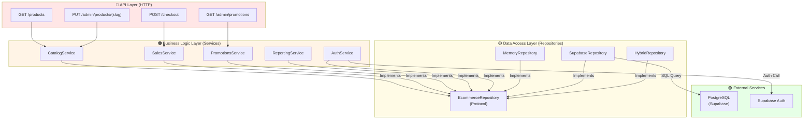
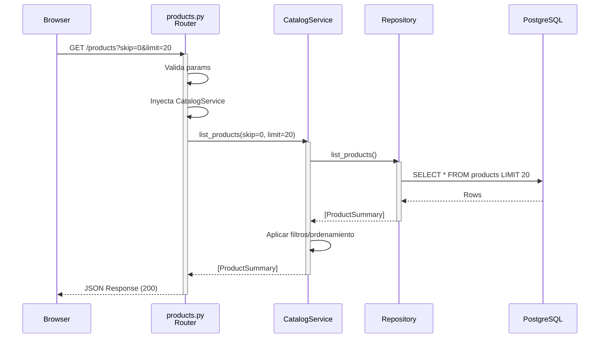
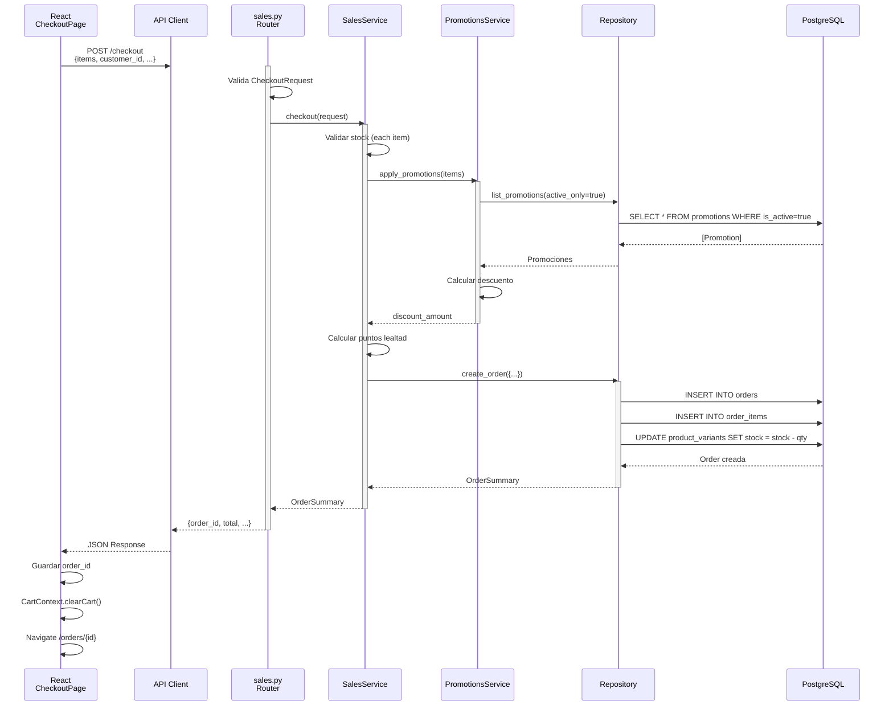
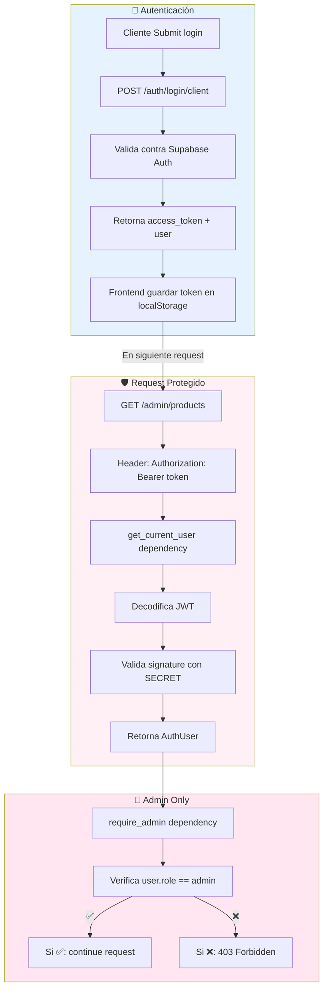
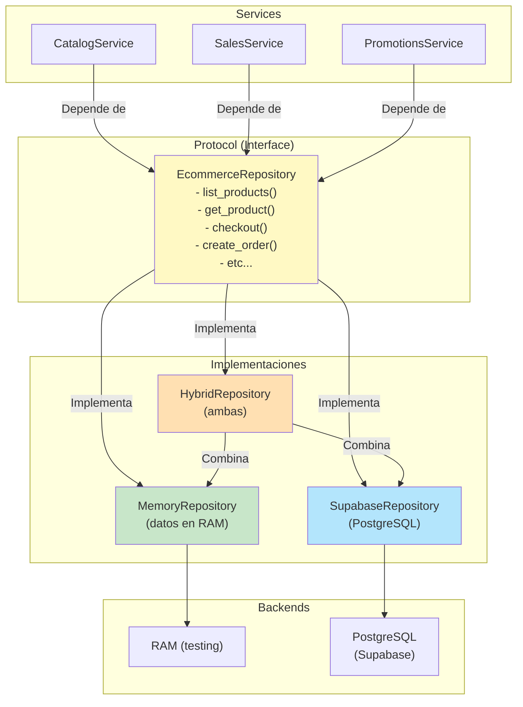
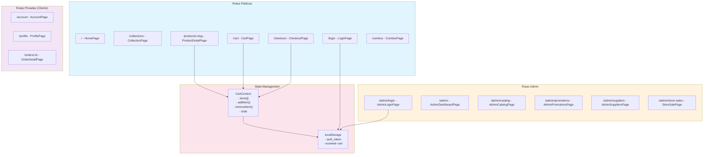
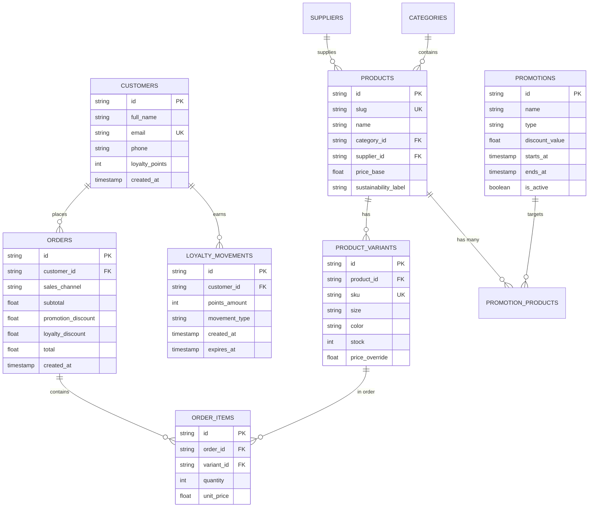
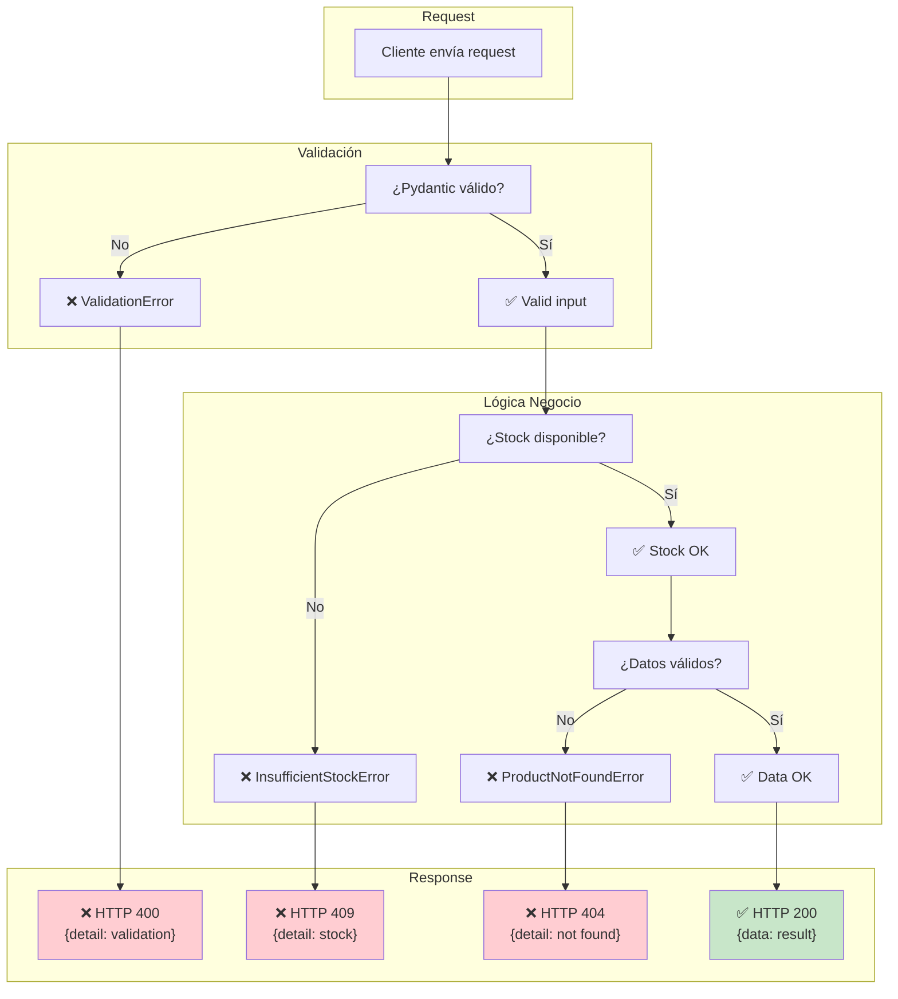
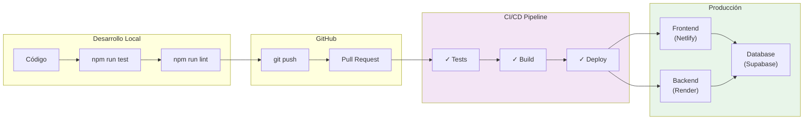

# Diagramas de Arquitectura - ReWo

## 1. Arquitectura General (3 Capas)

## 2. Backend - Capas (Layered Architecture)

## 3. Flujo de una Petición GET /products

## 4. Flujo de Checkout (POST /checkout)

## 5. Autenticación y Autorización

## 6. Repositorio Pattern (Abstracción de BD)

## 7. Frontend - Routing y State

## 8. Base de Datos - Modelo Relacional

## 9. Flujo de Error

## 10. Deployment Pipeline (Próximo)

